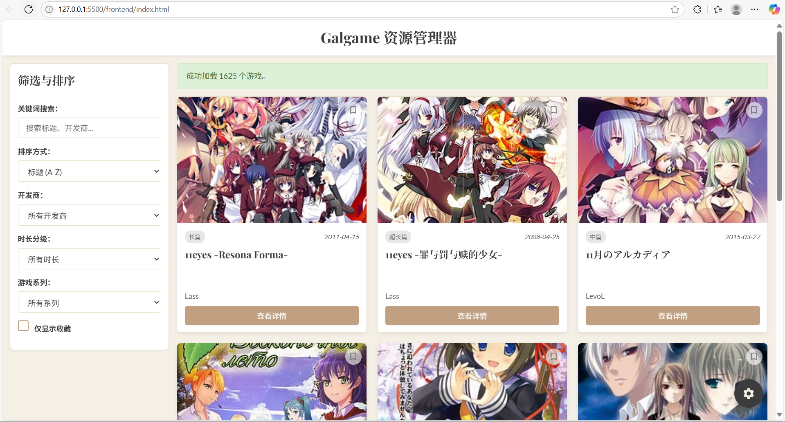

# GalgameMDManager Galgame 资源管理器
一个简单的 Markdown 文件资源管理和检索工具，专注于 Galgame 信息的整理与展示。
本项目使用 Python Flask 作为后端，纯 HTML, CSS, JavaScript 作为前端，实现了前后端分离的架构。
当然，也可以修改一下关键词作为其他领域的信息整理工具
为什么做gal管理器呢？因为我刚好拿到了一大坨galgame资料，急需整理
##  特别感谢
本项目的 Markdown 资源格式及部分内容灵感来源于 [ADV3-source](https://github.com/ACG-3/ADV3-source) 资源库。非常感谢其维护者和贡献者们整理的宝贵数据！你也可以从他们那里拿到galgame资源
感谢ai酱百忙之中抽时间给我写代码修bug，以及帮我水注释
##  展示图

##  主要功能
*   **动态加载**: 用户可在前端界面设置本地 Markdown 文件（`.md`）所在的文件夹绝对路径。
*   **数据解析**: 后端自动解析指定文件夹内所有 `.md` 文件的 Front Matter 和特定格式的正文内容。
*   **卡片式展示**: 以卡片形式清晰展示每个游戏的基本信息，包括封面、标题、开发商、发售日期、时长分级等。
*   **详情弹窗**: 点击卡片可查看游戏的完整详情，包括多语言名称、详细信息、简介、下载链接（含密码复制）、游戏截图等。
*   **实时搜索**: 根据关键词（标题、开发商、系列等）实时筛选游戏。
*   **多条件筛选**:
    *   按开发商筛选
    *   按时长分级筛选 (超短篇, 短篇, 中篇, 长篇, 超长篇, 未知时长)
    *   按游戏系列筛选
    *   仅显示收藏的游戏
*   **排序功能**:
    *   按标题 (A-Z, Z-A)
    *   按发售日期 (最新, 最早)
    *   按游戏时长 (长-短, 短-长)
*   **收藏功能**: 用户可以将喜欢的游戏标记为收藏，并筛选查看。收藏状态会保存在浏览器本地存储中。
*   **分页浏览**: 当游戏数量较多时，自动进行分页。
*   **图片懒加载**: 游戏封面图片使用懒加载技术，提升页面加载性能。
*   **响应式设计**: 界面在不同设备尺寸下均有较好的显示效果。
*   **错误/警告提示**: 对于解析错误或ID冲突等问题，会在界面上给出提示。
## 🛠️ 技术栈
*   **后端**: Python 3, Flask
    *   `Flask-CORS`: 处理跨域请求
    *   `python-frontmatter`: 解析 Markdown 文件中的 Front Matter
*   **前端**: HTML, CSS, JavaScript (原生，无框架)
*   **数据格式**: Markdown (`.md`)
##  项目结构
```
├── backend/
│   ├── app.py             # Flask 后端应用
│   └── requirements.txt   # Python 依赖列表
├── frontend/
│   ├── index.html         # 前端主页面
│   ├── script.js          # 前端交互逻辑
│   └── style.css          # 前端样式表
├── README.md              # 本说明文件
└── start_app.bat          # Windows 启动脚本
```
##  环境准备与启动
1.  **安装 Python**: 确保你已安装 Python 3.7 或更高版本，并已将其添加到系统环境变量 `PATH` 中。
2.  **克隆或下载项目**: 获取本项目所有文件。
3.  **安装依赖 (可选，脚本会自动尝试)**:
    打开命令行/终端，进入 `backend` 目录，然后运行：
    ```bash
    pip install -r requirements.txt
    ```
    或者，如果你在中国大陆，可以尝试使用国内镜像源加速下载：
    ```bash
    pip install -r requirements.txt -i https://pypi.tuna.tsinghua.edu.cn/simple
    ```
    (脚本 `start_app.bat` 会尝试自动执行此步骤。)
4.  **运行应用**:
    *   **Windows**: 直接双击项目根目录下的 `start_app.bat` 文件。
        *   它会自动检查/安装Python依赖，然后启动后端服务器，并用默认浏览器打开前端页面。
        *   后端服务会运行在 `http://127.0.0.1:7500`。
    *   **macOS/Linux (手动)**:
        1.  打开一个终端，进入 `backend` 目录，运行后端:
            ```bash
            python app.py
            ```
        2.  在浏览器中直接打开 `frontend/index.html` 文件。
##  使用说明
1.  启动应用后，前端页面会首先提示你设置 Markdown 文件夹路径。
2.  点击右下角的齿轮⚙️图标，会弹出路径设置框。
3.  在输入框中填入存放 `.md` 游戏资源文件的**文件夹绝对路径** (例如: `D:\MyGames\ADV3-source\_posts` 或 `/Users/username/games_md`)。
4.  点击 "加载资源" 按钮。
5.  应用会读取并解析该文件夹下的所有 `.md` 文件，并在主界面上展示游戏卡片。
6.  你可以使用侧边栏的搜索、排序和筛选功能来查找特定的游戏。
7.  点击游戏卡片上的 "查看详情" 按钮，可以打开包含更详细信息的弹窗。
##  注意事项
*   确保提供的文件夹路径是**绝对路径**，并且程序有权限读取该路径下的文件。
*   `.md` 文件的格式需要符合后端 `app.py` 中 `parse_markdown_file_content` 函数的解析逻辑，特别是 Front Matter 和各个二级标题（如 `## 游戏封面`, `## 游戏名称`, `## 游戏信息` 等）下的内容组织。
*   目前收藏夹数据存储在浏览器的 Local Storage 中，清除浏览器数据会导致收藏丢失。
*   后端对路径中的 `..` 进行了基本的安全检查，以防止路径遍历攻击。
 
